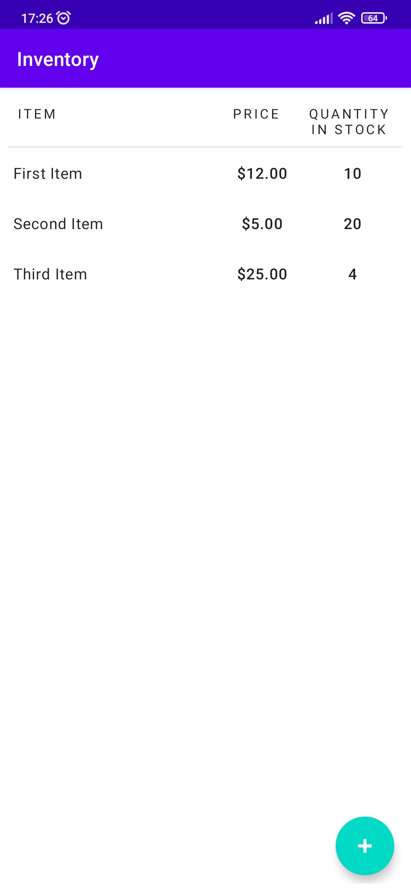
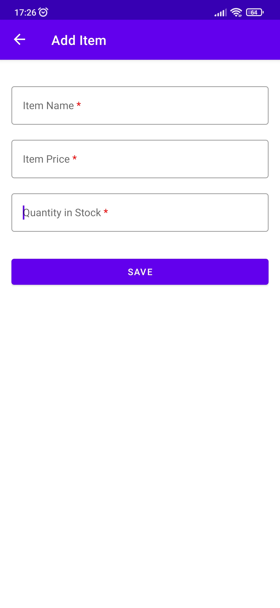
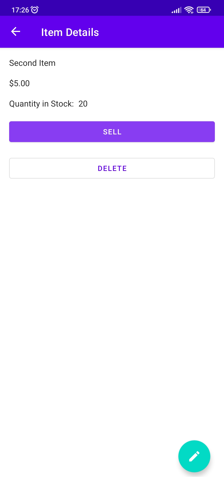
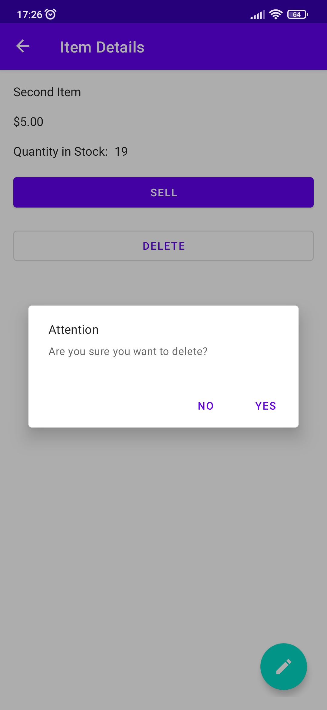
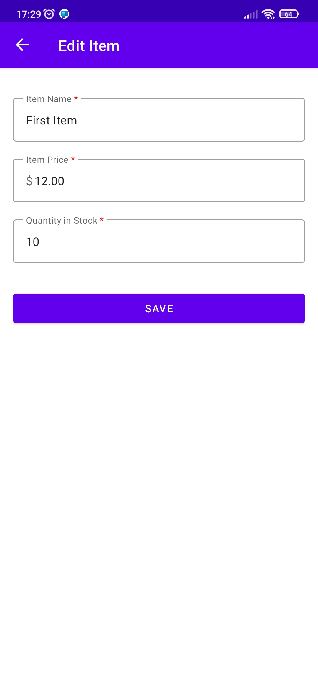

# Inventory

This is a simple inventory app for Android that was created as part
of [Android Basics in Kotlin](https://developer.android.com/courses/android-basics-kotlin/course) by
Google.

## Table of contents

- [How does it work](#How-does-it-work)
- [Screenshots](#Screenshots)
- [Technologies](#Technologies)
- [Development progress](#Development-progress)
- [Project statistics](#Project-statistics)
- [How to install](#How-to-install)
- [How to contribute](#How-to-contribute)

## How does it work

The user opens the app and sees the list of things. The user can edit and delete every item or add
new item.

## Screenshots

*All screenshots are relevant for version 1.0*

At the beginning:

After click on the add button:

After click on the item:

After click on the "SELL" button:

After click on the "DELETE" button:

After click on the edit button:

## Technologies

- The programming
  language [Kotlin](https://kotlinlang.org/) ([AdoptOpenJDK version 11.0.10](https://adoptopenjdk.net/))
  was chosen for development.

- Development was carried out in [Android Studio](https://developer.android.com/studio/).

- [Figma](https://www.figma.com/) was used to prototype the user interface.

- [WakaTime](https://wakatime.com/) was used to track activity.

- [Microsoft To Do](https://todo.microsoft.com/tasks/) was used to schedule tasks.

## Development progress

Development of the project began on **October 17, 2021** and completed on **October 19, 2021**.

*Since I am developing this project mainly alone, I see no reason to
use [Trello](https://trello.com/).*

## Project statistics

See more on [WakaTime](https://wakatime.com/@VitasSalvantes/projects/ftueygcdtf).

## How to install

1. Download the repository code as a zip archive
2. Unpack the zip archive
3. Open the unpacked project with Android Studio
4. Run the project

## How to contribute

The project was created as part
of [Android Basics in Kotlin](https://developer.android.com/courses/android-basics-kotlin/course) by
Google and does not provide for contribution.
